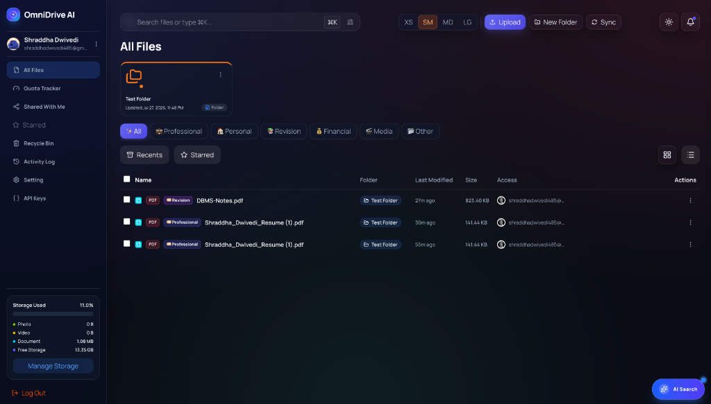
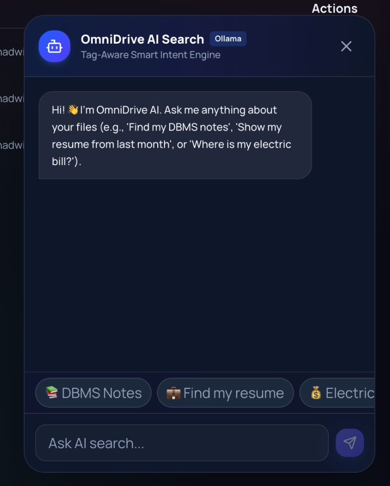
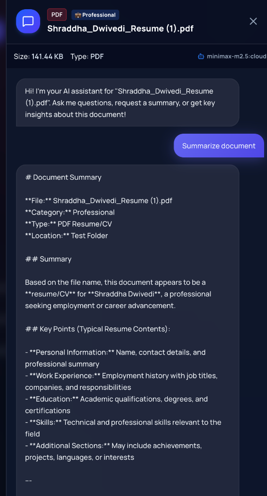
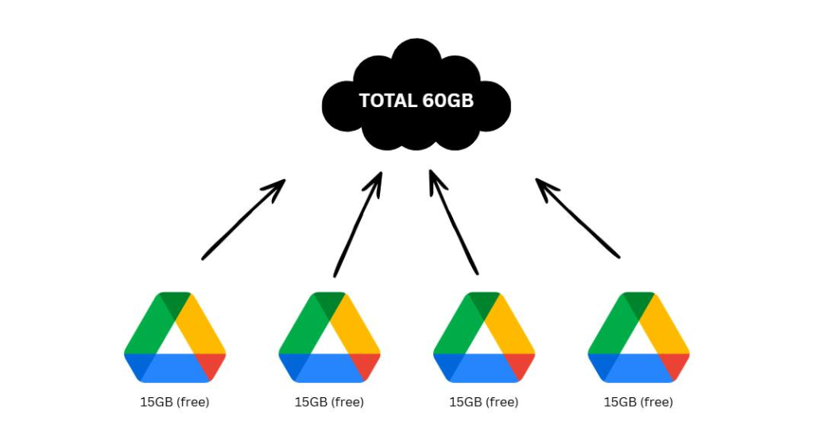
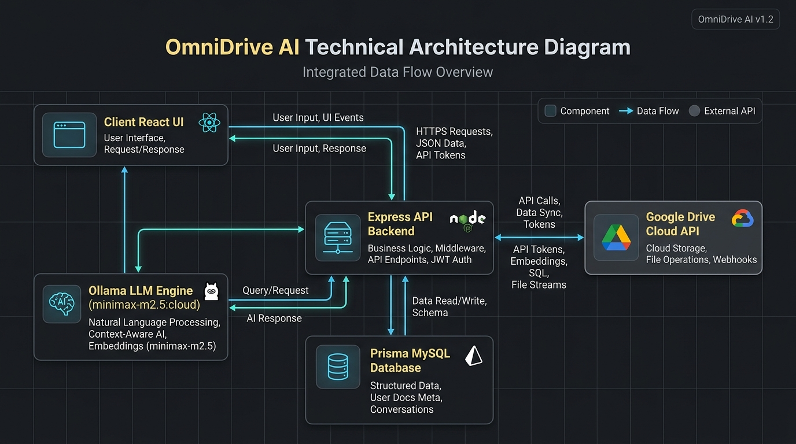

# 🌐 OmniDrive AI

> **Next-Generation Multi-Cloud Storage Gateway with AI Auto-Tagging, Tag-Aware Natural Language Search, Interactive Document Q&A & Multi-Account Quota Aggregation**

[](https://www.typescriptlang.org/)
[](https://react.dev/)
[](https://expressjs.com/)
[](https://www.prisma.io/)
[](https://ollama.com/)

---

## 🌟 Overview

**OmniDrive AI** is an intelligent, enterprise-grade cloud storage gateway designed to aggregate multiple Google Drive accounts and S3-compatible storage providers into a single virtual dashboard.

Instead of browsing through static folders or guessing exact file names, **OmniDrive AI** places artificial intelligence at the core of document management:
- **Automated AI File Classification**: Categorizes uploaded documents into 6 core categories (`Professional`, `Personal`, `Revision`, `Financial`, `Media`, `Other`).
- **Tag-Aware Natural Language Search**: Powered by local **Ollama (`minimax-m2.5:cloud`)** inference, extracting category intent first to prune the database search space by **80–90%**.
- **Interactive AI Search Chatbot**: Sleek floating bottom-right assistant widget (`✨ AI Search`) for natural conversational queries.
- **Document Q&A Side Drawer ("Chat with Document")**: Ask questions, request summaries, and extract insights directly from individual PDFs and documents in real-time.
- **Zero-Disk Streaming & Multi-Account Storage Pooling**: Route file uploads across multiple free Google Drive accounts (aggregating **60GB+ free storage**) and S3 storage without saving files to local disk.

---

## ✨ Core Features & Innovations

### 🧠 1. Tag-Aware Natural Language Search Engine (`POST /files/nlp-search`)



When a user enters a conversational search query like `"Can you find me my DBMS notes?"`, standard SQL wildcard searches fail. **OmniDrive AI** processes queries through a multi-stage AI intent pipeline:

1. **Tag Extraction (Category Pruning)**: Ollama identifies that `"notes"` and `"DBMS"` belong to **`📚 Category: Revision`**, narrowing database lookup to relevant file subsets.
2. **Conversational Cleaning**: Strips stop words (`"Can", "you", "find", "me", "my"`) to isolate core search entities (`["dbms", "notes"]`).
3. **Synonym Expansion**: Expands `dbms` to related terms (`["dbms", "database", "sql", "rdbms", "tables", "notes", "lecture"]`).

```typescript
// System Prompt guiding local Ollama LLM inference
export const NLP_SYSTEM_PROMPT = `
You are OmniDrive AI's Tag-Aware Search Intelligence Engine.
Parse the user query into a structured JSON:
{
  "categoryTag": "Professional" | "Personal" | "Revision" | "Financial" | "Media" | "Other" | "All",
  "keywords": ["clean", "search", "terms"],
  "explanation": "Brief reasoning"
}
`
```

---

### 📄 2. Document Q&A Side Drawer ("Chat with Document")



Hovering over any file row and clicking **`✨ Ask AI`** (or right-clicking and selecting **`✨ Chat with Document`**) opens a glassmorphic side panel:
- Sends document metadata, file details, and text context directly to Ollama (`minimax-m2.5:cloud`).
- Supports natural Q&A: *"Summarize Shraddha's resume"*, *"What are the main topics in chapter 3?"*, *"Extract invoice total amount"*.

---

### 🏷️ 3. Automated 6-Category Classification Engine

All uploaded files are automatically tagged upon upload:
- 💼 **Professional**: Resumes, CVs, offer letters, NDAs, contracts, performance reviews.
- 🏠 **Personal**: Recipes, workout plans, medical reports, rent agreements, travel itineraries.
- 📚 **Revision**: Lecture notes, cheat sheets, exam papers, DSA & DBMS study guides.
- 💰 **Financial**: Invoices, receipts, bank statements, tax filings, Form 16, utility bills.
- 🎬 **Media**: Images, photos, video recordings, audio tracks.
- 📂 **Other**: Archives, data backups, uncategorized files.

---

### ☁️ 4. Multi-Account Storage Pooling & Quota Aggregation



Google Drive grants 15GB of free storage per Google account. **OmniDrive AI** bridges multiple Google Drive accounts into a unified virtual storage pool:
- **Combined Storage Quota**: Connecting 4 free Google accounts aggregates a total pool of **60GB free storage** (`4 x 15GB = 60GB`).
- **Dynamic Upload Routing**: Evaluate available free space across connected accounts with configurable routing policies (`most-available`, `round-robin`, or `priority-order`).
- **Zero-Disk Streaming**: Streams uploads directly to Google Drive folder `omnidrive` or S3 storage without storing temporary files on server disk.
- **Bi-Directional Drive Sync**: Manually sync physical Google Drive files back into database metadata.

---

### 🔑 5. External Upload API & Developer Tools
- **RESTful Upload API**: External upload endpoint at `POST /api/v1/uploads`.
- **API Key Management**: Generate scoped API keys with one-time secret display, hashed database storage, last-used auditing, and instant revocation.
- **In-App API Documentation**: Embedded interactive cURL and JavaScript upload code examples inside the developer UI.

---

## 🏗️ Technical Architecture



```
                               ┌────────────────────────────────────────┐
                               │       Vite + React 19 Frontend         │
                               │  (Glassmorphic UI / AI Search Chatbot) │
                               └──────────────────┬─────────────────────┘
                                                  │ HTTP / REST API
                               ┌──────────────────▼─────────────────────┐
                               │        Express 5 + TypeScript          │
                               │           Backend Gateway              │
                               └──────┬──────────────────────┬──────────┘
                                      │                      │
                   ┌──────────────────▼──────┐        ┌──────▼──────────────────┐
                   │    Prisma 6 + MySQL     │        │  Local Ollama Service   │
                   │   (Virtual Folders /    │        │  (minimax-m2.5:cloud)   │
                   │   File Metadata DB)     │        └─────────────────────────┘
                   └─────────────────────────┘
                                      │ Streaming Uploads / Sync
                               ┌──────▼──────────────────┐
                               │   Google Drive API v3   │
                               │  (Folder: 'omnidrive')  │
                               └─────────────────────────┘
```

---

## 🛠️ Tech Stack

- **Frontend**: React 19, Vite 8, TypeScript, Tailwind CSS 4, Lucide React Icons.
- **Backend**: Express 5, TypeScript, Prisma ORM 6, MySQL / SQLite, Zod, Busboy Streaming, Argon2, JWT.
- **AI / LLM**: Ollama (`minimax-m2.5:cloud`), Tag-Aware Rule Parser Fallback.
- **Cloud Integration**: Google Cloud OAuth 2.0, Google Drive API v3, S3-Compatible Providers (MinIO, Cloudflare R2, AWS S3, Wasabi).

---

## ⚡ Quick Start

### 1. Prerequisites
- Node.js (v20+)
- npm / npx
- Ollama (running locally on port `11434` with model `minimax-m2.5:cloud`)

### 2. Backend Setup
```bash
cd backend
npm install
npm run prisma:generate
npm run dev
```

### 3. Frontend Setup
```bash
cd frontend
npm install
npm run dev
```

Open **`http://localhost:5173`** in your browser!

---

Created with ❤️ by **Shraddha Dwivedi**.
